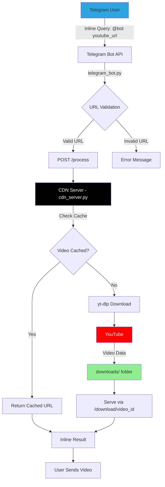

<p align="center"></p>

<div align="center">

# smileyTools

### YouTube Video Downloader & Inline Telegram Bot

<br/>

[](https://www.python.org/)
[](https://core.telegram.org/bots)
[](https://flask.palletsprojects.com/)
[](https://github.com/yt-dlp/yt-dlp)
[](LICENSE)

</div>

<br/>

> [!TIP]
> **Download and share YouTube videos directly in Telegram using inline mode> /home/yousefmsm1/Desktop/MyProjects/smileyTools/README.md << 'EOF'
<p align="center"></p>

<div align="center">

# smileyTools

### YouTube Video Downloader & Inline Telegram Bot

<br/>

[](https://www.python.org/)
[](https://core.telegram.org/bots)
[](https://flask.palletsprojects.com/)
[](https://github.com/yt-dlp/yt-dlp)
[](LICENSE)

</div>

<br/>

> [!TIP]
> **Download and share YouTube videos directly in Telegram using inline mode> /home/yousefmsm1/Desktop/MyProjects/smileyTools/README_TEMP.md << 'EOF'
EOF* Just paste a YouTube URL and the bot handles the rest.

---

## Overview

smileyTools is a powerful Telegram bot that downloads YouTube videos and serves them via inline mode. Built with Python, Flask, and yt-dlp, it provides a seamless way to share YouTube content directly in Telegram chats.

**Key Features:**
- 📥 **YouTube Downloader**: Download videos from YouTube, YouTube Shorts, and more
- 🤖 **Inline Mode**: Share videos directly in any Telegram chat
- 🚀 **CDN Server**: Built-in Flask server for video hosting
- 💾 **Smart Caching**: Videos are cached to avoid re-downloading
- ⚡ **Fast Processing**: Optimized download with yt-dlp
- 🔒 **Secure**: No data stored permanently, automatic cleanup

---


---

## Features

### YouTube Video Downloader
- Download videos from YouTube, YouTube Shorts, and other platforms
- Automatic format selection (best quality MP4)
- Smart caching system to avoid duplicate downloads
- Support for various video formats

### Inline Telegram Bot
- Use inline mode in any chat: `@YourBot https://youtube.com/...`
- Instant video preview and sharing
- No need to leave Telegram
- Works in groups, channels, and private chats

### CDN Server
## System Architecture


- Built-in Flask server for video hosting
- Efficient video streaming
- Automatic file management
- Public URL support via ngrok or similar services

---

## Installation

### Prerequisites
- Python 3.8 or higher
- pip (Python package manager)
- Telegram Bot Token (from [@BotFather](https://t.me/BotFather))

### Step 1: Clone the Repository
```bash
git clone https://github.com/YUST777/smileyTools.git
cd smileyTools
```

### Step 2: Install Dependencies
```bash
pip install -r requirements.txt
```

### Step 3: Configure Bot Token
Edit `telegram_bot.py` and replace the bot token:
```python
BOT_TOKEN = "YOUR_BOT_TOKEN_HERE"
```

### Step 4: Setup Public URL (Optional)
For production, you need a public URL for the CDN server. Use ngrok or similar:
```bash
ngrok http 5000
```

Update `CDN_SERVER` in `telegram_bot.py` with your public URL:
```python
CDN_SERVER = "https://your-ngrok-url.ngrok-free.dev"
```

---

## Usage

### Starting the Bot

You need to run both the CDN server and the Telegram bot:

**Terminal 1 - Start CDN Server:**
```bash
python cdn_server.py
```

**Terminal 2 - Start Telegram Bot:**
```bash
python telegram_bot.py
```

### Using the Bot

1. **Enable Inline Mode** in [@BotFather](https://t.me/BotFather):
   - Send `/setinline` to BotFather
   - Select your bot
   - Set inline placeholder text (e.g., "Paste YouTube URL...")

2. **Use in Any Chat:**
   ```
   @YourBotUsername https://youtube.com/shorts/SF93xtwbS1s
   ```

3. **Select and Send:**
   - The bot will process the video
   - Click on the result to send it to the chat

---

## Project Structure

```
smileyTools/
├── telegram_bot.py       # Main Telegram bot logic
├── cdn_server.py         # Flask CDN server for video hosting
├── requirements.txt      # Python dependencies
├── assests/
│   └── banner.jpg        # Project banner
├── downloads/            # Cached video files (auto-created)
├── .gitignore           # Git ignore rules
└── README.md            # This file
```

---

## Configuration

### Bot Configuration (`telegram_bot.py`)
```python
BOT_TOKEN = "YOUR_BOT_TOKEN"           # Get from @BotFather
CDN_SERVER = "http://localhost:5000"   # Your CDN server URL
```

### CDN Configuration (`cdn_server.py`)
```python
DOWNLOAD_DIR = Path("downloads")       # Video cache directory
```

---

## Dependencies

- **python-telegram-bot** (20.7): Telegram Bot API wrapper
- **Flask** (3.0.0): Web server for CDN
- **yt-dlp** (2023.12.30): YouTube video downloader
- **requests** (2.31.0): HTTP library

---

## How It Works

1. **User sends inline query** with YouTube URL
2. **Bot validates** the URL format
3. **Bot sends request** to CDN server with the URL
4. **CDN server checks cache** for existing video
5. **If not cached**, yt-dlp downloads the video
6. **CDN server returns** video URL to bot
7. **Bot shows inline result** with video preview
8. **User clicks** to send video to chat

---

## Important Notes

### Production Deployment
- Use a public URL for the CDN server (ngrok, VPS, cloud hosting)
- Update `CDN_SERVER` in `telegram_bot.py` with your public URL
- Enable inline mode in BotFather
- Consider adding authentication for the CDN server
- Implement automatic cleanup for old videos

### Rate Limiting
- YouTube may rate limit downloads
- Consider implementing request throttling
- Use proxy rotation for high-volume usage

### Storage Management
- Videos are cached in `downloads/` folder
- Implement automatic cleanup for old files
- Monitor disk space usage

---

## Troubleshooting

### Bot doesn't respond to inline queries
- Make sure inline mode is enabled in BotFather
- Check that both servers are running
- Verify bot token is correct

### Videos fail to download
- Check internet connection
- Verify YouTube URL is valid
- Update yt-dlp: `pip install -U yt-dlp`

### CDN server not accessible
- Ensure Flask server is running on correct port
- Check firewall settings
- Verify ngrok or public URL is working

---

## Future Enhancements

- [ ] Add support for playlists
- [ ] Implement video quality selection
- [ ] Add thumbnail generation
- [ ] Support for more video platforms
- [ ] Automatic old file cleanup
- [ ] User statistics and analytics
- [ ] Admin panel for monitoring

---

## License

This project is licensed under the MIT License - see the [LICENSE](LICENSE) file for details.

---

## Contributing

Contributions are welcome! Please feel free to submit a Pull Request.

---

<div align="center">

### Built for the Telegram Community

*Download and share YouTube videos seamlessly in Telegram*

<sub>Made with ❤️ by [@YUST777](https://github.com/YUST777)</sub>

</div>
EOF* Just paste a YouTube URL and the bot handles the rest.

---

## Overview

smileyTools is a powerful Telegram bot that downloads YouTube videos and serves them via inline mode. Built with Python, Flask, and yt-dlp, it provides a seamless way to share YouTube content directly in Telegram chats.

**Key Features:**
- 📥 **YouTube Downloader**: Download videos from YouTube, YouTube Shorts, and more
- 🤖 **Inline Mode**: Share videos directly in any Telegram chat
- 🚀 **CDN Server**: Built-in Flask server for video hosting
- 💾 **Smart Caching**: Videos are cached to avoid re-downloading
- ⚡ **Fast Processing**: Optimized download with yt-dlp
- 🔒 **Secure**: No data stored permanently, automatic cleanup

---

