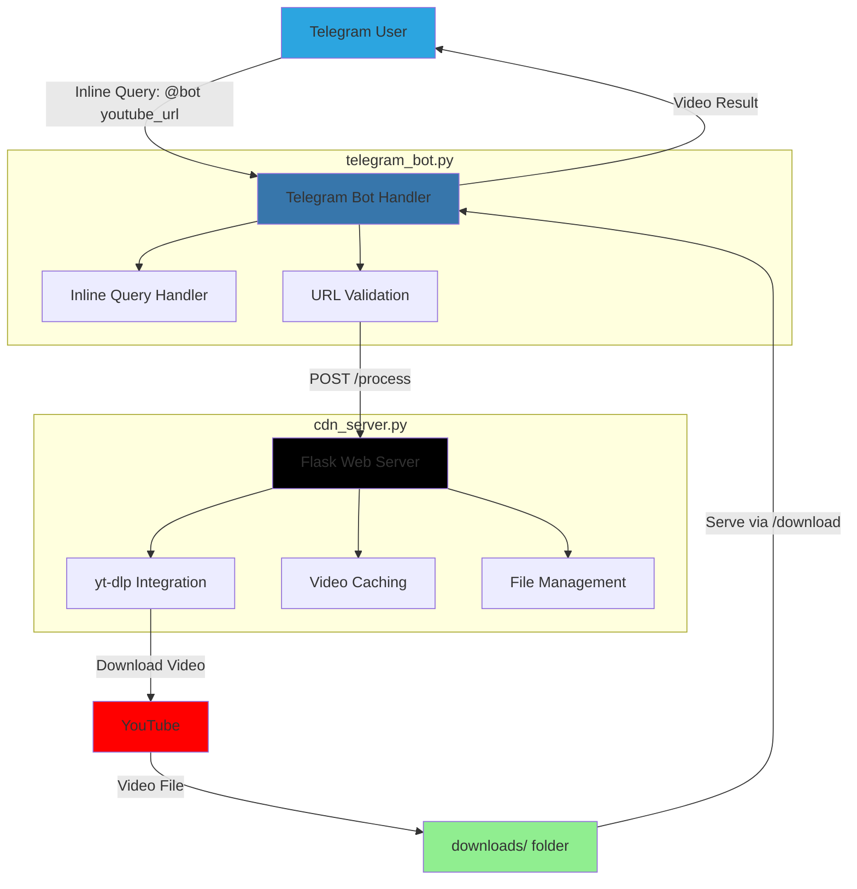

## System Architecture

```mermaid
graph TB
    A[Telegram User] -->|Inline Query: @bot youtube_url| B[Telegram Bot API]
    
    subgraph "telegram_bot.py"
    B[Telegram Bot Handler]
    B1[Inline Query Handler]
    B2[URL Validation]
    B --> B1
    B --> B2
    end
    
    B2 -->|POST /process| C[CDN Server]
    
    subgraph "cdn_server.py"
    C[Flask Web Server]
    C1[yt-dlp Integration]
    C2[Video Caching]
    C3[File Management]
    C --> C1
    C --> C2
    C --> C3
    end
    
    C1 -->|Download Video| D[YouTube]
    D -->|Video File| E[downloads/ folder]
    E -->|Serve via /download| B
    B -->|Video Result| A
    
    style A fill:#2CA5E0
    style B fill:#3776AB
    style C fill:#000000
    style D fill:#FF0000
    style E fill:#90EE90
```
