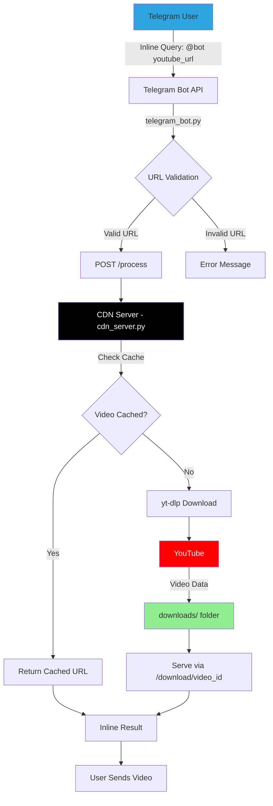

## System Architecture

```mermaid
graph TB
    A[Telegram User] -->|Inline Query: @bot youtube_url| B[Telegram Bot API]
    B -->|telegram_bot.py| C{URL Validation}
    C -->|Valid URL| D[POST /process]
    C -->|Invalid URL| E[Error Message]
    D --> F[CDN Server - cdn_server.py]
    F -->|Check Cache| G{Video Cached?}
    G -->|Yes| H[Return Cached URL]
    G -->|No| I[yt-dlp Download]
    I --> J[YouTube]
    J -->|Video Data| K[downloads/ folder]
    K --> L[Serve via /download/video_id]
    H --> M[Inline Result]
    L --> M
    M --> N[User Sends Video]
    
    style A fill:#2CA5E0
    style F fill:#000000,color:#fff
    style J fill:#FF0000,color:#fff
    style K fill:#90EE90
```
